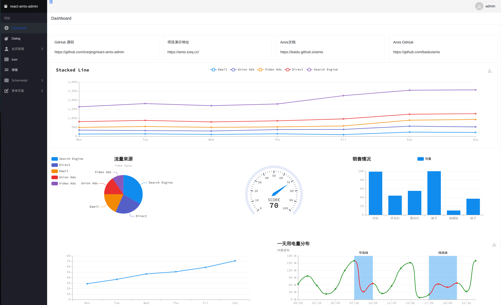

<div align="center">
  <p>
    
  </p>

[react-amis-admin在线文档](https://docs.amis.iceq.cc) |
[演示网站](https://amis.iceq.cc)|
[项目源码](https://github.com/iceqing/react-amis-admin)|
[Amis文档](https://baidu.github.io/amis/) |
[Amis可视化编辑器](https://aisuda.github.io/amis-editor-demo/) 
</div>


> 本仓库主要目的在于提供一个开箱可用的`Amis` + `React` 低代码开发环境, 提供`vite`和`webpack`两种版本打包的方式。
> 支持`Amis`低代码, 同时支持`React`原生方式开发或者可选支持`Antd`等组件来定制复杂页面。
> 本工程不包含后端代码，前后端分离。

## 使用方法
```
npm i
npm start
```


即可访问页面,效果如下




## 如何新增一个Amis页面？

**如果想阅读更多react-amis-admin开发说明，请参考[在线文档](https://docs.amis.iceq.cc)**


>通过`Amis`只需要写`JSON`(或者根据拖拽生成的`JSON`)即可完成开发一个页面，极大减轻了后台页面前端工作量。

### 1、首先在pages下新增一个Hello.tsx页面

其中`schema`即amis的JSON代码，具体可以参考 [官方文档](https://baidu.github.io/amis/zh-CN/components/page)

```tsx
import schema2component from "@/utils/schema2component";

const schema = {
    "type": "page",
    "title": "hello",
    "body": {
        "label": "弹框",
        "type": "button",
        "actionType": "dialog",
        "dialog": {
            "title": "弹框",
            "body": "这是个简单的弹框。"
        }
    }
}

export default schema2component(schema);
```

### 2、增加路由配置
在`path2Compoment`文件导入Hello组件
```tsx
import Hello from "@/pages/Hello";
```

然后在path2components对象增加路由
```
{
        path: '/hello',
        component: Hello
}
```

### 3、启动项目，测试即可
通过`npm start`,然后输入
[http://localhost:8080/hello](http://localhost:8080/hello)即可访问刚刚新建的页面


## vite与webpack的介绍

提供`vite`和`webpack`两种版本打包的方式，对应`vite`和`webpack`分支。
`vite`由于采用`esm`机制，热更新会更快。`webpack`由于目前广泛使用，插件更丰富，使用方可以根据自己的场景做选择。


## Amis文档

`Amis`官方文档： https://baidu.github.io/amis/zh-CN/docs/index

`Amis`官方可视化编辑器： https://aisuda.github.io/amis-editor-demo/#/hello-world

## 参考

本仓库灵感来自于以下几个仓库：

https://github.com/baidu/amis

https://github.com/aisuda/amis-admin

https://github.com/aisuda/amis-react-starter

https://github.com/PanJiaChen/vue-element-admin

https://baidu.gitee.io/amis/examples/index

## 其他

图标网站：
https://fontawesome.com/v6/search?o=r&m=free

## 鸣谢
特别感谢 [JetBrains](https://www.jetbrains.com/?from=react-amis-admin) 为开源项目提供免费的 [IntelliJ WebStorm](https://www.jetbrains.com/idea/?from=mirai) 等 IDE 的授权  
[](https://www.jetbrains.com/?from=react-amis-admin)

## Star History

[](https://star-history.com/#iceqing/react-amis-admin&Date)